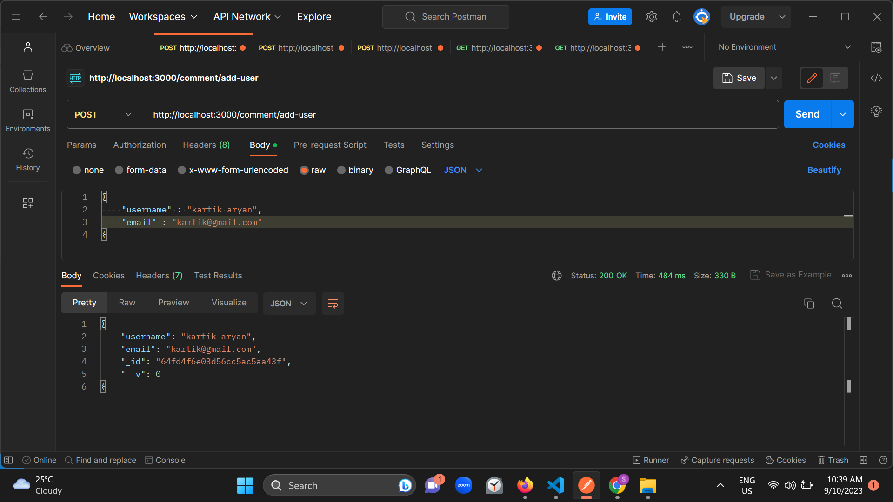
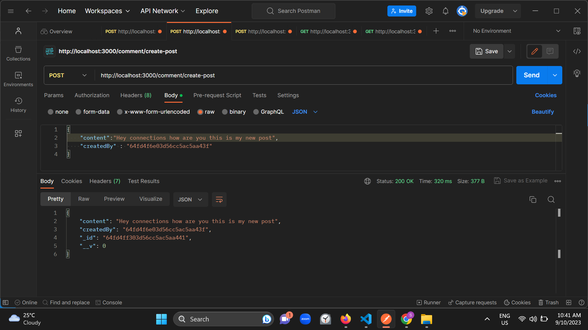
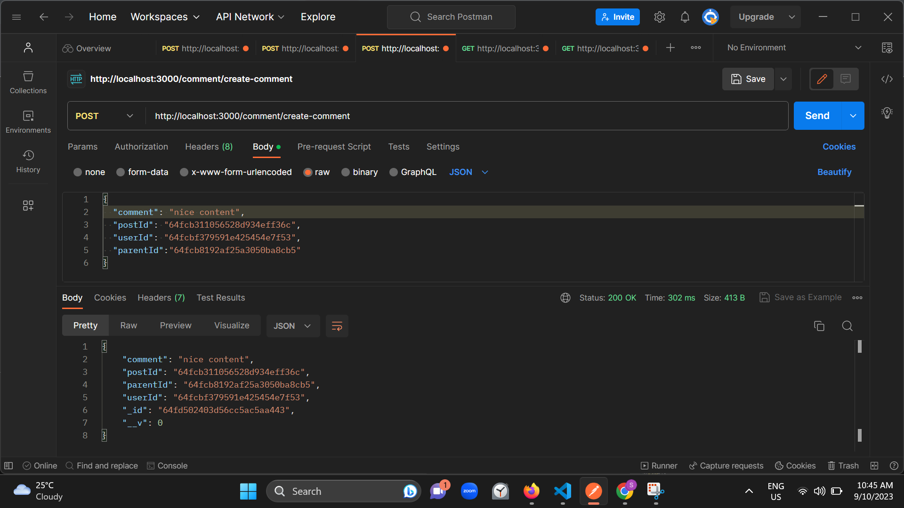
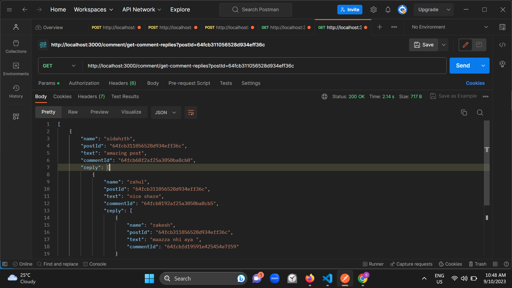

# API Documentation

This documentation provides details on the API endpoints for creating and managing users, posts, comments, and fetching comment replies.


## Models

### User Model
```json
{
  "_id": "user_id",
  "username": "john_doe",
  "email": "john.doe@example.com"
}
```

### Post Model
```json
{
  "_id": "post_id",
  "content": "This is a new post.",
  "createdBy": "user_id"
}
```

### Comment Model
```json
{
  "_id": "comment_id",
  "comment": "This is a comment on the post.",
  "postId": "post_id",
  "parentId": null,
  "userId": "user_id"
}
```


## User Routes

### Create User
## User Routes

### Create User

- **URL:** `/api/users/add-user`
- **Method:** `POST`
- **Description:** Create a new user.
- **Request Body:**
  - `username` (string, required): User's username.
  - `email` (string): User's email address.
- **Response:**
  - Status: `200 OK`
  - Body: JSON representation of the created user.

### Post Routes

### Create Post

- **URL:** `/api/posts/create-post`
- **Method:** `POST`
- **Description:** Create a new post.
- **Request Body:**
  - `content` (string, required): Post content.
  - `createdBy` (string, required): ID of the user who created the post.
- **Response:**
  - Status: `200 OK`
  - Body: JSON representation of the created post.

## Comment Routes

### Create Comment

- **URL:** `/api/comments/create-comment`
- **Method:** `POST`
- **Description:** Create a new comment on a post.
- **Request Body:**
  - `comment` (string, required): Comment text.
  - `postId` (string, required): ID of the post where the comment is made.
  - `parentId` (string): ID of the parent comment (if it's a reply).
  - `userId` (string, required): ID of the user who made the comment.
- **Response:**
  - Status: `200 OK`
  - Body: JSON representation of the created comment.


### Fetch Comment Replies

- **URL:** `/api/comments/get-comment-replies`
- **Method:** `GET`
- **Description:** Fetch comments and their replies for a specific post.
- **Query Parameters:**
  - `postId` (string, required): ID of the post to fetch comments for.
- **Response:**
  - Status: `200 OK`
  - Body: JSON representation of comments and their replies.


```json
[
    {
        "name": "sidahrth",
        "postId": "64fcb311056528d934eff36c",
        "text": "amazing post",
        "commentId": "64fcb68f2af25a3050ba8cb0",
        "reply": [
            {
                "name": "rahul",
                "postId": "64fcb311056528d934eff36c",
                "text": "nice share",
                "commentId": "64fcb8192af25a3050ba8cb5",
                "reply": [
                    {
                        "name": "rakesh",
                        "postId": "64fcb311056528d934eff36c",
                        "text": "maazza nhi aya ",
                        "commentId": "64fcbfd19591e425454e7f59"
                    }
                ]
            }
        ]
    },
    {
        "name": "rohit",
        "postId": "64fcb311056528d934eff36c",
        "text": "nice share",
        "commentId": "64fcbf6f9591e425454e7f57"
    }
]
```


 ## API RESPONSE 
  
   
   
   
